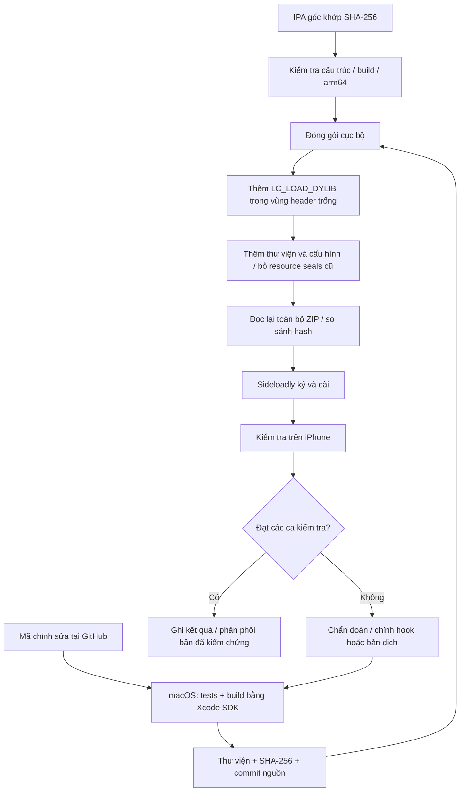

# Kế hoạch triển khai

## 1. Đích đến và điều kiện chấp nhận

Thiết bị đích là iPhone 15, iOS 18.5; ký/cài qua Sideloadly. Mục đích là xem video công khai với ít gián đoạn, điều khiển tiếng Anh và lọc quảng cáo đã nhận diện. Không thêm tài khoản, không can thiệp xác thực mạng. Chỉ gọi bản sửa “hoàn chỉnh đã kiểm thử” sau khi kiểm tra chức năng, giao diện và ổn định trên thiết bị đạt yêu cầu.

## 2. Đường đi của thay đổi

## 3. Nhắc đăng nhập

Metadata của AwemeCore trong đúng mẫu cho thấy `AWEForceLoginGuideAlertManager`, `AWEPreLoginAlertManager`, `AWEMVForceLoginGuideInFlowController`, `AWEMVForceLoginGuideOutFlowController` và các view model gợi ý đăng nhập. Cấu hình lưu lớp, selector, method kind, type encoding và địa chỉ implementation để đối chiếu.

Chặn tại hàm quyết định hiển thị (`canShow`, `canShowNow`, `shouldShowHalfLogin`), cờ vô hiệu hóa guide trong luồng cuộn và cổng hiển thị nút. Không chặn hàm có callback đăng nhập vì callback chưa được xác định đầy đủ; bỏ qua callback tùy tiện có thể gây treo hàng đợi hoặc để player ở trạng thái chờ.

Thư viện kiểm tra type encoding trước mỗi lần cài hook. Nếu lớp chưa nạp, thử lại sau khởi động/foreground và tại mốc 1/3/8 giây. Không hook `isLogin`, `requireLogin`, keychain, chứng chỉ, request signing hoặc response status. Khi máy chủ yêu cầu đăng nhập, lỗi thật vẫn được giữ lại; kết quả này phải được phân biệt với popup nhắc đăng nhập phía client.

## 4. Quảng cáo

`AWEAwemeModel.isAds` có kiểu BOOL không tham số. Ba lớp response có getter/setter `awemeList` kiểu object. Lọc tại cả getter và setter giúp bao phủ setter thông thường và response được gán ivar trực tiếp. Chỉ bỏ model trả về BOOL true từ `isAds`; model lạ, không có method hoặc trả kiểu khác được giữ nguyên. Thứ tự và tính mutable của danh sách được giữ; không sửa input tại chỗ, không sửa cursor/hasMore, không tạo retry vô hạn khi cả trang là quảng cáo.

Chặn các cổng splash trong `AWESplashManager`, `AWEAwesomeSplashManager`, `AWEAwesomeBiddingSplashManager`, cùng `tryToShowSplash`. Không chặn toàn bộ domain CDN vì video và quảng cáo có thể dùng chung hạ tầng. Không báo impression quảng cáo giả. Không hứa loại bỏ quảng cáo do creator chèn trong video, banner của mọi tính năng hay các trang web nhúng chưa kiểm tra.

## 5. Tiếng Anh và bố cục

App có 104 file `.strings/.stringsdict`, nhiều file thuộc SDK phụ; không có bảng tiếng Anh hoàn chỉnh cho giao diện Douyin chính. Không thay raw byte chuỗi trong binary vì độ dài có thể khác, phá offset và mã.

Bảng 278 cặp Trung–Anh dùng phép khớp toàn chuỗi. Nhãn được xử lý khi đổi text và khi gắn vào window; kiểm tra ancestor/responder để ưu tiên giao diện app và bỏ qua class có tên caption/comment/subtitle/username/chat/search content. Đây là biện pháp dựa vào tên lớp cần xác nhận bằng thiết bị, chưa chứng minh tất cả caption đều được loại trừ.

Button, placeholder, nav/tab title và localized strings được xử lý riêng. Attributed text chỉ dịch khi một bộ attributes phủ toàn chuỗi, giữ attributes ban đầu; chuỗi nhiều style giữ nguyên. Nhãn một dòng có giới hạn co chữ 65%, khôi phục thiết lập cũ khi nhãn được dùng lại cho chữ không dịch. Không đổi constraints, không thu nhỏ font toàn ứng dụng. Tắt/bật tiếng Anh cần khởi động lại để các title đã tạo được dựng lại.

Permissions text sử dụng bản tiếng Anh đã có trong mẫu; tên hiển thị là Douyin Guest. Màn WebView/Lynx, chữ trong ảnh và chuỗi máy chủ ngoài từ điển cần bổ sung từ bằng chứng runtime, không dùng API dịch gửi dữ liệu cá nhân ra ngoài.

## 6. Đóng gói và bảo toàn

- Kiểm tra hash nguồn trước/sau, kiến trúc arm64, min iOS, build, ZIP paths và hash thư viện.
- Thêm load command có đường dẫn `@executable_path/Frameworks/DouyinGuest.dylib` trong khoảng trống đã xác nhận; giữ nguyên độ dài executable, section offsets và toàn bộ nội dung sau vùng sửa header.
- Streaming ZIP, giữ mode/symlink metadata; sửa bốn tên UTF-8 bị thiếu flag trong nguồn khi đóng gói.
- Xóa resource signature seals/provisioning cũ để không đưa chữ ký không còn phù hợp như một chứng thực mới. Sideloadly ký lại sau.
- Ghi manifest SHA-256 cho mọi entry; đọc lại toàn output, CRC được zipfile kiểm tra trong quá trình đọc. Không đưa IPA lên repository hoặc dịch vụ scan bên ngoài.

## 7. Xác minh và vòng sửa

Python tests kiểm tra bounds/path/hash/injection không dịch chuyển code và các trường hợp từ chối. Foundation tests chạy trên macOS kiểm tra lọc dữ liệu, kiểu hàm sai, danh sách trống, giữ nội dung, attributed styles, override kế thừa và chuyển về implementation gốc khi tắt. Build dùng warnings-as-errors và kiểm tra chữ ký ad-hoc thư viện.

Thiết bị thật cần kiểm tra cold/warm start, cuộn dài, foreground/background, mạng lỗi, các kiểu video, dịch/layout và tắt từng nhóm để so sánh. Chẩn đoán chỉ ghi bộ đếm hook và phiên bản, không nội dung sử dụng. Thay đổi phát sinh phải chạy lại các test liên quan trước khi tạo candidate tiếp theo. Không tạo release cuối cùng trước khi các ca bắt buộc đạt.
